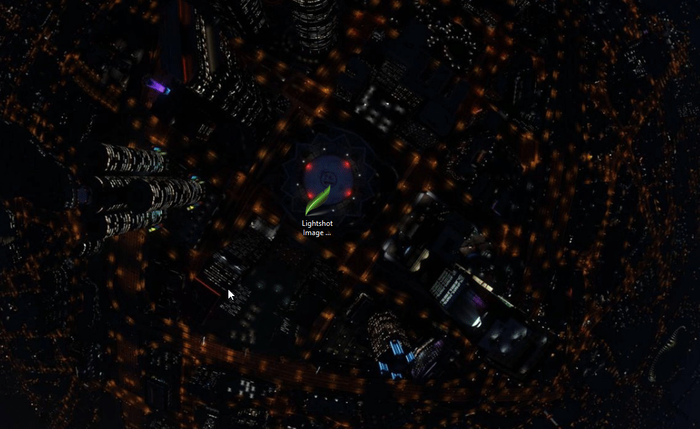

# Lightshot-Image-Scraping
Simple application that downloads random Lightshot screenshots. 

### WARNING: These are random images taken by people, because of this there may be gore, NSFW, obscene images, and more

## How to Use:
1. Download the latest release
2. Run the file
3. Agree to the Terms
4. Put in the folder
5. Put in the amount of images to scrape

## Make Sure You Have Chrome Installed

## Terms
This program and source code is only for educational purposes. It shows the dangers of using a screenshot tool that automatically uploads images to a image host.

Any damage caused by this program is not the creators responsibility

These are random images taken by people, because of this there may be gore, NSFW, obscene images, and more

Only continue if you don't mind seeing images as such

DO NOT CONTINUE USING THIS PROGRAM OR THE SOURCE CODE IF YOU DO NOT AGREE WITH THE ABOVE
